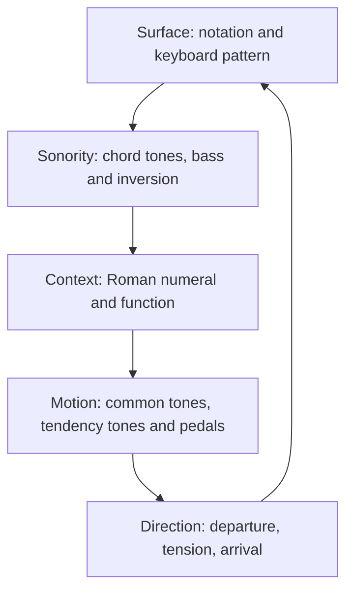

# Harmony Lab Piece-Practice Manual

## Use Case 01 — J. S. Bach: Prelude in C major, BWV 846

**Document version:** 0.1  
**Status:** expandable working handout  
**App basis:** `score-reading-app`, branch `fable_refactor`, commit `859bbf5658099fea9661ec3e7d438273c98ecb54`  
**Analysis basis:** the branch's curated 34-measure, no-Schwencke-bar BWV 846 sidecar  
**Level:** basic → intermediate music theory  

---

## 1. Purpose

This manual helps you use Harmony Lab to develop a personal routine for approaching a piece. It is designed to help you:

- reduce the written surface to **scales, chord tones, bass notes and harmonic functions**;
- discover repeated **patterns, motions and directions**;
- reconstruct a forgotten passage from its harmonic and physical logic;
- connect abstract curriculum exercises to a real score;
- record observations that can be corrected or expanded later.

It is **not** a fixed course, prescribed daily programme or claim that harmonic analysis can replace the score. Choose the question, span, lenses and tools that serve the problem you actually have in a session.

## 2. The central mental model

Treat a passage as several layers describing the same music:



You may enter the loop anywhere. For example, a wrong bass note may lead you from the surface to inversion; an unexplained accidental may lead you from motion to a secondary dominant; a memory failure may lead you from function back to the arpeggio pattern.

### The five reconstruction questions

For any chosen measure or short span, ask:

1. **What collection sounds?** Which pitch classes belong to the bar?
2. **What is underneath?** What is the bass, and is it the root or an inversion/pedal?
3. **What does it mean here?** What Roman numeral and function does it have in the current key?
4. **How did it get here and where is it going?** Which notes stay, move by step, or act as tendency tones?
5. **How does Bach unfold it?** What register, order, repeated cell and fingering turn the skeleton back into the score?

Harmony answers questions 1–4 only partially. Question 5 is why the original notation and physical keyboard pattern remain indispensable.

## 3. What harmony can and cannot reconstruct

| Information | Example | What it gives you |
|---|---|---|
| **Key/scale** | C major: C–D–E–F–G–A–B | The diatonic pitch vocabulary and degree names |
| **Chord symbol** | G7 | Root, chord quality and chord-tone set |
| **Roman numeral** | V7 | The chord's relation to the current tonic |
| **Function** | dominant | Its broad job: tension directed toward tonic |
| **Figure/inversion** | V6/5 | Which chord member is in the bass |
| **Voice-leading** | B→C and F→E | The local motion that creates resolution |
| **Surface figuration** | Bach's repeated broken-chord cell | Exact note order, register, rhythm, articulation and fingering |

The label **I** does not tell you the exact octave, voicing or arpeggio order. Conversely, memorising the arpeggio without understanding **I** leaves you with fewer recovery cues. Reconstruction comes from combining both.

## 4. The two-workspace method

### 4.1 Score Soul — observe the real piece

Run:

```powershell
.venv/Scripts/python.exe run_score_harmonic_network_demo.py
```

The window contains:

- **Left — Score Soul:** form sections, measures, cadences, the current chord card and the piece-specific radial graph.
- **Centre — score:** the real BWV 846 score with Previous, Next and measure-walk controls.
- **Right — Harmonic Scene + Atlas:** the current measure's place in the score path and in the general tonal map.

Use it to select a section or measure and ask what the curated analysis claims. The view synchronises the score cursor, measure card, score-specific graph and Atlas.

Important limitation: Score Soul has **no embedded trainer**. Clicking an Atlas drill in this launcher is intentionally ignored. Record the concept you want to isolate, then open Harmony Lab.

### 4.2 Harmony Lab — generalise, hear and play the concept

Run:

```powershell
.venv/Scripts/python.exe run_harmony_lab_demo.py
```

The workspace contains:

- **Left — curriculum:** searchable lessons and exercises with explanations and progress.
- **Middle — Harmony Trainer:** generated notation, guide panel, MIDI/on-screen/QWERTY input and target playback.
- **Right tabs:** Home, Atlas, Harmonic Scene, Circle of Fifths, Cheatsheet and Current Mapping.

Use the Lab to turn a score observation into an isolated experiment: play the C-major chord field, compare inversions, resolve V7, hear a cadence, or spot an applied chord.

### 4.3 Return to the score

The Lab exercise is a **model**, not a literal replacement for Bach's voicing. Return to BWV 846 and:

- identify where the model occurs;
- restore Bach's bass, register and figuration;
- play from an internal starting point;
- test whether the harmonic cue helps memory and musical direction.

## 5. Tool and feature reference

| Tool/feature | Best question | How to use it | Honesty limit |
|---|---|---|---|
| **Score Soul navigator** | What chord/section is this measure in the curated map? | Click a section, measure, cadence or graph occurrence | It is curated measure-level analysis, not a universal automatic analyser |
| **Score Harmonic Scene** | How does this measure belong to the piece's path? | Follow the highlighted occurrence as you move measure by measure | It shows the encoded analysis; it does not decide your interpretation |
| **Atlas** | What general scale/degree/quality/function is this? | Inspect Global Map, Function, Interval Layer, Cadence and Transposition views | Its core ontology is general; some chromatic score events map only partially |
| **Curriculum search/tree** | Which playable concept matches my problem? | Search a term such as `C major`, `V7`, `cadential 6/4`, `secondary dominant` or `inversion` | A search result is a model exercise, not proof of the score analysis |
| **Harmonic Scene in Lab** | What bounded relationship does this selected exercise teach? | Launch a curriculum leaf and inspect its routed scene | Unknown/reserved concepts may have no scene |
| **Current Mapping** | What is the trainer asking now? | Watch key, degree, quality, layer and function update with the target | It follows the generated exercise, not the separate Score Soul score |
| **Target playback** | What should this drill sound like? | Use Play/Pause, Stop, Loop and 30–240 bpm tempo control | Playback demonstrates generated notation, not your tone or technique |
| **MIDI grading** | Did I play the expected pitch material/order? | Play on the Nektar keyboard; use Prev/Next/Reset or jump through the chord list | Pitch correctness is not rhythmic evenness, phrasing, tone, dynamics or tension freedom |
| **Echo drill** | Can I reproduce the same vocabulary by ear? | Start the visual leaf once, then use its unlocked 🎧 twin | It shares the visual leaf's mastery record and grades the same pitch target |
| **Home/review queue** | What previously attempted Lab material is due? | Launch due cards or heatmap cells inside the Lab | The queue schedules curriculum leaves, not repertoire measures |
| **Functional Degree Network** | How do tonic, predominant and dominant relate? | Optionally run the major staged journey and explore C's degree graph | It is an optional mental-model aid, not a prerequisite or fixed path |

### MIDI rules worth remembering

- **Block chords:** octave-agnostic chord coverage; the exercise advances after the required tones have sounded and keys are released.
- **Arpeggio/melody walks:** ordered and normally octave-exact when the notation supplies exact slots.
- **Figured-bass/strict-bass drills:** the demanded bass must be the lowest sounding chord tone.
- **Wrong pitch:** may show red or fail to advance, depending on the exercise contract.
- **Not graded:** touch, balance, rhythm, accent, articulation, pedal, continuous relaxation and musical direction unless a future feature explicitly says otherwise.

## 6. BWV 846: the piece-level harmonic model

### 6.1 Edition warning

The app's curated pilot uses a **34-measure music21 corpus edition without the Schwencke insertion**. If your printed score numbers measures differently, align the actual chords and section boundaries before copying measure numbers into your notes.

### 6.2 Surface idea

BWV 846 is ideal for harmonic reconstruction because a comparatively stable broken-chord texture projects changing harmonies. Hear each measure first as a **harmonic container**, then notice how Bach preserves common tones or changes individual notes to redirect the line.

This does not mean every bar is a simple root-position triad. The piece includes seventh chords, inversions, applied dominants, fully diminished sevenths, pedal points, suspensions and extensions.

### 6.3 Global direction

```text
establish C → expand away from C → tonicise targets → intensify the predominant/dominant
→ hold the dominant on G → return to a C pedal → final V–I arrival
```

| Section | Measures | Harmonic idea | Direction to feel |
|---|---:|---|---|
| Opening tonic statement | 1–4 | I–ii7–V6/5–I | Home is stated, left briefly and confirmed |
| Tonal expansion | 5–11 | vi colour plus two V7/V→V motions | The harmony leans toward the dominant region |
| Sequential descent | 12–19 | Applied diminished sevenths alternate with diatonic targets | Chromatic tension repeatedly resolves and descends toward a local I |
| Pre-dominant intensification | 20–23 | V7/IV→IV, then leading-tone sevenths | The approach to the structural dominant becomes more urgent |
| Dominant pedal | 24–30 | G is prolonged beneath V7, cadential 6/4 and suspension colours | Bass stability does not mean relaxation; upper voices intensify the dominant |
| Tonic pedal and close | 31–34 | C returns in the bass while V7/IV, ii7 and V7 delay the close | Home is physically present before it is harmonically confirmed |

### 6.4 C-major vocabulary

The diatonic triads are:

| Degree | Chord | Quality | Broad role |
|---|---|---|---|
| I | C–E–G | major | tonic/home |
| ii | D–F–A | minor | predominant |
| iii | E–G–B | minor | mediant/tonic–dominant ambiguity |
| IV | F–A–C | major | subdominant/predominant |
| V | G–B–D | major | dominant |
| vi | A–C–E | minor | tonic substitute/colour |
| vii° | B–D–F | diminished | leading-tone dominant |

Add one diatonic third to obtain seventh chords: Imaj7, ii7, iii7, IVmaj7, V7, vi7 and viiø7. BWV 846 frequently uses these richer sonorities.

### 6.5 Chromatic vocabulary used in the piece

| Chord | Pitches | Meaning in C major | Tendency/target |
|---|---|---|---|
| **V7/V = D7** | D–F♯–A–C | Dominant of G, temporarily treating V as a local tonic | F♯ tends to G; resolves to V |
| **V7/IV = C7** | C–E–G–B♭ | Dominant of F, turning tonic-root C into an applied dominant | B♭ tends toward A inside IV |
| **vii°7/ii = C♯°7** | C♯–E–G–B♭ | Applied leading-tone seventh of D minor | C♯ rises to D |
| **vii°7/V = F♯°7** | F♯–A–C–E♭ | Applied leading-tone seventh of G | F♯ rises to G |
| **vii°7 = B°7** | B–D–F–A♭ | Altered leading-tone seventh directed to C | B rises to C; A♭ normally falls toward G |

These are instances of **tonicisation**: a non-tonic degree receives its own dominant or leading-tone chord without the piece necessarily modulating to a new long-term key.

### 6.6 Full measure map

Use this as a hypothesis/checking table, not as something to memorise before playing.

| m. | Chord / Roman | Function or status | Motion/direction cue | Closest Lab concept |
|---:|---|---|---|---|
| 1 | C, **I** | tonic | State home | C-major full-key; tonic arpeggio |
| 2 | Dm7, **ii7** | predominant over tonic support | Move away while retaining common tones | Seventh qualities; ii7–V7–I |
| 3 | G7/B, **V6/5** | dominant, first inversion | Leading-tone bass aims at C | V7 figured inversions; V7→I |
| 4 | C, **I** | tonic | Opening authentic resolution | V–I cadence; SATB voice leading |
| 5 | Am, **vi** | tonic colour/substitute | Darken home without leaving its family | Functions; tonic substitutes |
| 6 | D7, **V7/V** | chromatic applied dominant | F♯ points to G | Secondary dominants: V7/V |
| 7 | G/B, **V6** | dominant | Arrival on the tonicised V | Inversions: V in C |
| 8 | Cmaj7, **Imaj7** | tonic seventh colour | Return to C with unresolved B colour | Seventh qualities: major seventh |
| 9 | Am7, **vi7** | tonic prolongation | Continue tonic-family expansion | Minor seventh quality |
| 10 | D7, **V7/V** | chromatic applied dominant | Repeat the push toward G | Spot/resolve V7/V |
| 11 | G, **V** | dominant | Dominant region confirmed | Function: V; dominant node |
| 12 | C♯°7, **vii°7/ii** | chromatic applied leading-tone chord | C♯ points to D | Applied leading-tone sevenths |
| 13 | Dm/F, **ii6** | first-inversion predominant | F in bass prepares G | ii6–V–I inversion bridge |
| 14 | B°7, **vii°7** | altered leading-tone dominant | B points to C | Diminished seventh; resolution |
| 15 | C/E, **I6** | tonic first inversion | Resolve while keeping upward bass continuity | Inversions: I in C |
| 16 | Fmaj7, **IV7** | subdominant/predominant colour | Broaden away from tonic | Major seventh; IV function |
| 17 | Dm7, **ii7** | predominant | Prepare V | ii7–V7–I |
| 18 | G7, **V7** | dominant | Strong local tension | Add the seventh; tritone resolution |
| 19 | C, **I** | tonic | Local resolution | V7→I |
| 20 | C7, **V7/IV** | chromatic applied dominant | B♭ redirects C toward F | Secondary dominants: V7/IV |
| 21 | F / Fmaj7 colour, **IV** | subdominant | Applied target reached | IV function; seventh colour |
| 22 | F♯°7, **vii°7/V** | chromatic applied leading-tone chord | F♯ intensifies the move to G | Applied leading-tone sevenths |
| 23 | B°7, **vii°7** | altered dominant preparation | Leading-tone pressure concentrates | Diminished seventh; V–I tendency frame |
| 24 | G7, **V7** | dominant | Begin long G pedal | V7; dominant prolongation |
| 25 | C/G, **I6/4** | cadential 6/4; functionally dominant | Tonic spelling over dominant bass | Cadential 6/4 hear/relabel pair |
| 26 | G7, **V7** | dominant | 6/4 suspensions settle into V | V7→I; tritone |
| 27 | F♯°7, **vii°7/V** | chromatic decoration of dominant pedal | Intensify G without leaving the dominant field | Applied leading-tone seventh of V |
| 28 | C/G, **I6/4** | cadential 6/4 | Second dominant suspension event | Cadential 6/4 |
| 29 | G11sus, **V11sus** | ambiguous suspension stack | G–C–D–F delays the leading tone; no clean triad | Suspension/pedal analysis; no exact simple-triad drill |
| 30 | G7, **V7** | dominant | Suspension resolves and dominant is confirmed | V7 |
| 31 | C7, **V7/IV** | applied dominant over tonic C pedal | C has returned, but B♭ prevents final rest | V7/IV |
| 32 | Dm7, **ii7** | predominant over C pedal | Final preparation | ii7–V7–I |
| 33 | G7(13), **V7(13)** | extended dominant over C pedal | Maximum tension before close | V7→I; recognise extension as dominant field |
| 34 | C, **I** | final tonic | Closing perfect authentic cadence | PAC/V–I; cadence voice leading |

## 7. Piece-to-curriculum map

Do not attempt all 405 curriculum leaves. Admit a leaf only when it answers a score question.

| Score question | Curriculum location/search term | Relevant measures | What to carry back |
|---|---|---:|---|
| What chords belong naturally to C major? | **Scales → Major scales & triads → C major**, block and arpeggio | Whole piece | Seven-degree field and chord spelling |
| What is home, preparation and tension? | **Functions → Major functional progressions**; optional Functional Network | 1–4, 16–19, 31–34 | Tonic → predominant → dominant → tonic direction |
| Why does the bass differ from the root? | **Inversions → C major I/ii/IV/V** | 3, 7, 13, 15, 25, 28 | Root identity stays; bass controls inversion and motion |
| How does V7 resolve? | **Seventh Chords → Add the 7th / Tritone resolution / V7→I** | 3–4, 18–19, 24–34 | 7̂→1̂ and 4̂→3̂ tendency motions |
| How does ii7 prepare V7? | **Seventh Chords → ii7–V7–I**, block then arpeggiated | 2–4, 17–19, 32–34 | Predominant continuity and common tones |
| Why is I6/4 not restful? | **Cadences → The cadential 6/4** | 25–26, 28–30 | Bass 5̂ has already arrived; 6–5 and 4–3 are suspensions over V |
| What is V7/V or V7/IV? | **Advanced Topics → Secondary dominants** | 6, 10, 20, 31 | Imported leading tone, local target and resolution |
| What are vii°7/V and vii°7/ii? | **Advanced Topics → Applied chords: the ramp → Leading-tone sevenths** | 12, 22, 27 | Chromatic leading-tone chord points to a diatonic target |
| Can I hear the bass route? | **Inversions → Bass-line dictation** | Any selected span | Bass as structural melody |
| Can I reproduce the idea without notation? | Eligible leaf's **🎧 Echo drill** | Chosen model | Aural recall before visual confirmation |

### Suggested concept palette for BWV 846

Begin with whatever solves the current problem. A useful palette, from simpler to richer, is:

- C-major seven-chord field;
- I–IV–V–I and ii–V–I functions;
- C-major I, ii and V inversions;
- V–I cadence and voice leading;
- V7 and ii7–V7–I;
- cadential 6/4;
- V7/V and V7/IV;
- vii°7/ii and vii°7/V;
- bass dictation and echo variants.

This list describes increasing conceptual density, not a mandatory order.

## 8. Build a session without creating a fixed programme

### 8.1 Choose a session question

Examples:

- What makes measures 1–4 feel complete?
- Why does F♯ appear in measure 6?
- How do measures 12–15 form a chain of attraction and resolution?
- Why is the C-major chord in measure 25 not “home”?
- How can C already be in the bass in measure 31 while the piece still feels unfinished?
- Which bass notes allow me to recover measures 24–34 from memory?

### 8.2 Select a span

Prefer a musically meaningful unit: one measure, a two-chord resolution, a four-measure phrase, a sequence, or one pedal region. The span should be small enough that you can name its skeleton without looking away from the question.

### 8.3 Choose any two or three practice cards

You do not need every card in every session.

#### Card A — Surface scan

- Cold-play or silently read the span.
- Circle accidentals, repeated shapes and bass changes.
- Mark where the physical pattern stays the same while one note changes.
- Write one question; do not analyse everything.

#### Card B — Harmonic compression

- List distinct pitch classes in each measure.
- Separate **bass** from upper pitch collection.
- Propose root, quality, inversion and Roman numeral.
- Check Score Soul; mark agreement, disagreement or uncertainty.
- Play the compressed chords as blocks.

#### Card C — Scale-degree/function map

- Convert roots and important tones to scale degrees.
- Label broad function: tonic, predominant/subdominant or dominant.
- Say the path aloud as action: “home → prepare → tension → home.”
- Use the Lab's Function or Cadence exercise if the path is unclear.

#### Card D — Motion map

- Draw arrows for semitone/whole-step tendencies.
- Box common tones.
- Trace the bass as a separate melody.
- Identify any pedal note that stays while upper harmony changes.

#### Card E — Generalise in Harmony Lab

- Search the one concept exposed by the passage.
- Read the explanation before launching.
- Listen once with target playback.
- Play the simplest form that answers the question: block before arpeggio when chord identity is unclear.
- Inspect Atlas, Harmonic Scene and Current Mapping.
- Optionally use Echo after the visual leaf has been started.

#### Card F — Reconstruct the Bach surface

- Close or cover the score.
- State the chord path and bass path.
- Play block skeletons.
- Restore Bach's voicing and repeated figuration.
- Open the score and correct only the first divergence.
- Repeat from a different internal starting measure.

#### Card G — Performance transfer

- Play the span musically rather than as a theory demonstration.
- Let harmonic direction influence voicing, timing and release.
- Record one take.
- Judge pulse, balance, tension, phrase direction and recovery—none of which the MIDI chord grader certifies.

#### Card H — Update the model

- Record one verified observation.
- Record one unresolved or alternative reading.
- Link the observation to the relevant Lab leaf.
- Decide whether the item should be revisited, expanded or retired.

## 9. Reusable session handout

Copy this section for each session.

### Session identity

- **Date:**
- **Piece/edition:**
- **Measures/section:**
- **Session question:**
- **Chosen cards/lenses:**
- **Current performance defect:**

### First observation

- **Cold-play result:**
- **Accidentals noticed:**
- **Repeated physical/visual pattern:**
- **Bass path:**
- **Where tension increased or released:**

### Harmonic worksheet

| Measure/span | Pitch collection | Bass | Root/quality | Roman/figure | Function | Motion/common tones | Confidence 1–3 |
|---|---|---|---|---|---|---|---:|
|  |  |  |  |  |  |  |  |
|  |  |  |  |  |  |  |  |
|  |  |  |  |  |  |  |  |

### App evidence

- **Score Soul claim:**
- **Atlas/Network mapping:**
- **Harmony Lab leaf used:**
- **Target playback observation:**
- **MIDI result:**
- **What the app did not assess:**

### Reconstruction evidence

- [ ] I can state the chord path without the score.
- [ ] I can state or sing the bass path.
- [ ] I can play the block skeleton.
- [ ] I can restore the written figuration.
- [ ] I can start from at least one internal measure.
- [ ] I can explain the direction of the span in plain language.

### Update record

- **Verified observation:**
- **Alternative/uncertain reading:**
- **First divergence when reconstructing:**
- **Performance change produced by the analysis:**
- **Possible next question:**
- **Retain / expand / retire this Lab leaf:**

## 10. Filled example — opening phrase, measures 1–4

### Question

How does Bach establish C major, leave it and return within four measures?

### Compression

```text
m1 I  →  m2 ii7  →  m3 V6/5  →  m4 I
home     prepare      tension      arrival
```

### Suggested use

1. Cold-play measures 1–4 and note where tension changes.
2. In Score Soul, select **Opening tonic statement** and inspect measures 1–4.
3. Write the chord path above. In m3, identify B as the bass of G7: this is V6/5, not a new root.
4. In Harmony Lab, choose whichever model answers the weakest link:
   - `ii7–V7–I` for the seventh-chord path;
   - `V7 figured-bass inversions` for V6/5;
   - `V7→I` or `V–I voice leading` for resolution;
   - C-major full-key only if chord spelling itself is uncertain.
5. Play I–ii7–V7–I as blocks. Then restore the actual bass and Bach figuration.
6. Cover the score and start from m2, then m3. If memory fails, recall “predominant → inverted dominant → tonic” before looking.
7. Record one run and judge whether the dominant sounds directed into m4 without added physical tension.

### What to learn—not merely label

- The same tonic can be reached by recognising the **function chain**, not only by remembering the next hand shape.
- The inversion in m3 makes the bass itself participate in the resolution.
- The Lab's root-position ii7–V7–I model is a reduction; Bach's actual voicing must be restored from the score.

## 11. Intermediate extension — dominant pedal, measures 24–30

### Question

Why does a largely stable G bass create increasing tension rather than stasis?

### Compression

```text
V7 → I6/4 → V7 → vii°7/V → I6/4 → V11sus → V7
             all heard inside a prolonged dominant field on G
```

### Suggested use

- In Score Soul, move measure by measure through the **Dominant pedal** section.
- Hold or repeatedly return to G while reducing upper sonorities to blocks.
- Use Harmony Lab's **cadential 6/4** pair to hear why C/G is dominant in function despite tonic spelling.
- Use **Applied chords → Leading-tone sevenths** for vii°7/V in m27.
- Treat m29 as a suspension stack, not a failed triad-identification exercise: the curated map deliberately marks it ambiguous.
- Reconstruct the span bass-first. Add upper chord tones, then the repeated surface pattern.
- Let the dominant field grow through voicing and direction; do not create tension by stiffening the hand.

## 12. Key terms and concepts

| Term | Working definition |
|---|---|
| **Pitch class** | A note identity independent of octave, such as every C |
| **Scale degree** | A note's numbered position within a key; C=1̂ and B=7̂ in C major |
| **Triad** | Three-note chord built from stacked thirds: root, third and fifth |
| **Seventh chord** | A triad plus another third, producing root–3rd–5th–7th |
| **Root** | The note from which the chord is conceptually built; not always the bass |
| **Bass** | The lowest sounding note; it determines inversion and often carries structural direction |
| **Inversion** | A voicing in which a chord member other than the root is in the bass |
| **Chord symbol** | Absolute chord label such as D7 or G/B |
| **Roman numeral** | Contextual chord label such as V7/V or V6, relative to the key |
| **Figured bass** | Numbers indicating intervals above the bass and therefore inversion, such as 6/5 |
| **Interval layer** | The stacked-third pattern defining chord quality, e.g. M3+m3 for major |
| **Tonic** | Home function centred on I |
| **Predominant** | Function that prepares the dominant, commonly ii or IV |
| **Dominant** | Tension function directed toward tonic, commonly V, V7 or vii° |
| **Harmonic rhythm** | The rate at which the underlying harmony changes |
| **Voice-leading** | How individual notes move or stay between chords |
| **Common tone** | A pitch retained from one harmony to the next |
| **Tendency tone** | A pitch with a strong directed resolution, such as 7̂→1̂ |
| **Tritone** | The unstable interval inside V7 between 7̂ and 4̂, resolving inward/outward to tonic tones |
| **Cadence** | A harmonic/voice-leading event that creates pause or arrival |
| **Perfect authentic cadence (PAC)** | A strong V–I close with root-position structural conditions and tonic in the final soprano |
| **Tonicisation** | Briefly treating a non-tonic chord as a local target with its own dominant/leading-tone chord |
| **Secondary/applied dominant** | V7 of a degree other than I, e.g. V7/V |
| **Applied leading-tone chord** | vii° or vii°7 of a temporary target, e.g. vii°7/V |
| **Diatonic** | Belonging to the current scale's ordinary pitch collection |
| **Chromatic** | Using a pitch outside that collection to colour or redirect the harmony |
| **Pedal point** | A sustained/repeated bass note under changing harmonies |
| **Suspension** | A held tone that becomes dissonant and normally resolves by step |
| **Cadential 6/4** | Tonic-spelled second-inversion chord over dominant bass, functioning as a dominant embellishment |
| **Prolongation** | Extending one structural harmony through intervening or decorative sonorities |
| **Harmonic skeleton/reduction** | A simplified chord/bass path beneath the written figuration |
| **Surface figuration** | The exact rhythmic, registral and physical pattern presenting the harmony |
| **Confidence** | How securely an analytical claim is supported; uncertainty should be recorded, not hidden |

## 13. Expansion protocol

For the next piece, duplicate this document and replace only the piece-specific layers:

1. edition/source warning;
2. scale and chord vocabulary;
3. global directional map;
4. sections and complete measure map;
5. piece-to-curriculum links;
6. one basic and one intermediate filled session;
7. piece-specific terms and unresolved questions.

Keep the mental model, tool reference, practice cards and blank session handout stable unless experience shows that they need revision.

### Change log

| Version | Date | Change | Evidence/source |
|---|---|---|---|
| 0.1 | 2026-08-15 | Initial reusable manual and BWV 846 use case | `fable_refactor` curated sidecar + current curriculum/tool documentation |

## 14. Branch sources

- [`data/score_annotations/bwv846_prelude_c_major.json`](https://github.com/JozsefKiss90/score-reading-app/blob/fable_refactor/data/score_annotations/bwv846_prelude_c_major.json)
- [`docs/score_soul_graph.md`](https://github.com/JozsefKiss90/score-reading-app/blob/fable_refactor/docs/score_soul_graph.md)
- [`docs/curriculum.md`](https://github.com/JozsefKiss90/score-reading-app/blob/fable_refactor/docs/curriculum.md)
- [`docs/harmony_lab.md`](https://github.com/JozsefKiss90/score-reading-app/blob/fable_refactor/docs/harmony_lab.md)
- [`docs/harmony_trainer.md`](https://github.com/JozsefKiss90/score-reading-app/blob/fable_refactor/docs/harmony_trainer.md)
- [`docs/harmony_atlas.md`](https://github.com/JozsefKiss90/score-reading-app/blob/fable_refactor/docs/harmony_atlas.md)
- [`docs/functional_network.md`](https://github.com/JozsefKiss90/score-reading-app/blob/fable_refactor/docs/functional_network.md)
- [`docs/progress_dashboard.md`](https://github.com/JozsefKiss90/score-reading-app/blob/fable_refactor/docs/progress_dashboard.md)

